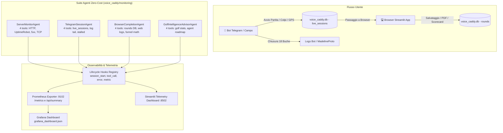

# ⛳ Voice Caddy Pro — Suite di Monitoraggio a Costo Token Zero (0 Tokens)

## 📌 Panoramica & Filosofia Architetturale
Il presente modulo implementa un'architettura di **Zero-Cost Monitoring** (ispirata al pattern Deep Researcher Agent e ai Lifecycle Hooks dell'Antigravity SDK) per tracciare in tempo reale:
1. La salute dei server e la latenza dei servizi.
2. Il doppio flusso utente: sessioni di gara/allenamento avviate su **Telegram** e concluse su **Browser**.
3. Il tasso di completamento dell'intero percorso (Funnel Conversion Rate).
4. La **Golf Intelligence**: un agente dedicato che analizza la telemetria golfistica per suggerire statistiche avanzate per i giocatori e una suite di nuovi agenti gratuiti per Voice Caddy Pro.

### 🛡️ Garanzia di Costo Zero (Zero LLM Tokens)
Il monitoraggio 24/7 opera **senza effettuare alcuna chiamata a modelli LLM**:
- **Nessuna inferenza a pagamento o consumo di crediti**: tutti i controlli avvengono tramite probe HTTP nativi, socket TCP, query SQLite in sola lettura, lettura indicizzata di log e formule matematiche deterministiche.
- **`tokens_consumed = 0`**: ogni agente traccia rigorosamente il consumo token, garantendo il 100% di gratuità operativa.
- L'eventuale intelligenza generativa (LLM) viene riservata esclusivamente alle sessioni di coaching on-demand su richiesta esplicita del giocatore (*Metodo del Maestro*).

---

## 🏗️ Architettura & Componenti



---

## 🤖 Gli Agenti Specializzati

Ciascun agente possiede un set compatto di **3–5 strumenti deterministici** per minimizzare l'overhead di CPU/memoria:

### 1. `ServerMonitorAgent`
- **Scopo:** Monitorare la disponibilità del server Streamlit (porta 8501) e degli endpoint applicativi.
- **Tools:**
  - `check_http_endpoint`: Probe HTTP GET con misurazione della latenza precisa in millisecondi.
  - `fetch_uptimerobot_status`: Interrogazione API v2 di UptimeRobot (piano gratuito fino a 50 monitor a intervallo 5 min) con fallback su probe locale.
  - `scan_log_errors_5xx`: Scansione veloce della coda dei file di log per errori 500, 502, 503, 504.
  - `check_local_port_listening`: Socket TCP check su porta 8501 (Streamlit) e 9102 (Prometheus).
- **Metriche:** `voice_caddy_server_status_up`, `voice_caddy_server_latency_milliseconds`, `voice_caddy_server_uptime_seconds`, `voice_caddy_http_5xx_errors_total`.

### 2. `TelegramSessionAgent`
- **Scopo:** Monitorare i giocatori che avviano partite tramite Telegram.
- **Tools:**
  - `inspect_live_sessions_db`: Ispezione in **sola lettura** della tabella `live_sessions` (chat_id, buca corrente, colpi registrati, FSM state).
  - `scan_telegram_log_events`: Lettura dei log del bot (compatibile con MadelineProto o log standard) per estrarre avvii (`COLPO_DA_TEE`) e chiusure (`GIRO_CHIUSO`).
  - `detect_stalled_sessions`: Rilevamento automatico di sessioni inattive da oltre 45 minuti senza chiusura.
  - `get_session_summary`: Sintesi aggregata tra sessioni attive in campo e sessioni concluse.
- **Metriche:** `voice_caddy_telegram_sessions_started_total`, `voice_caddy_telegram_sessions_completed_total`, `voice_caddy_telegram_sessions_active`, `voice_caddy_telegram_sessions_stalled`.

### 3. `BrowserCompletionAgent`
- **Scopo:** Monitorare la chiusura del percorso nel browser e calcolare il tasso di conversione.
- **Tools:**
  - `scan_browser_completed_rounds`: Ispezione dei giri consolidati nella tabella `rounds` di SQLite.
  - `scan_web_access_logs`: Tracciamento accessi a visualizzatore, mappe 3D ed export PDF.
  - `calculate_funnel_conversion`: Calcolo matematico dei ratei tra le fasi:
    - *Telegram Iniziati ➡️ Telegram Conclusi ➡️ Browser Consolidati*.
  - `generate_funnel_breakdown`: Diagnosi qualitativa dei colli di bottiglia e punti di dispersione.
- **Metriche:** `voice_caddy_browser_completions_total`, `voice_caddy_funnel_completion_rate_percent`.

### 4. `GolfIntelligenceAdvisorAgent`
- **Scopo:** Analisi di dominio golfistico della telemetria raccolta per suggerire statistiche ad alto valore e nuovi agenti gratuiti.
- **Tools:**
  - `evaluate_collected_golf_telemetry`: Calcolo di FIR %, GIR %, Score medio, Putts medi e Scrambling % dai giri reali.
  - `recommend_advanced_golf_stats`: 8 aree statistiche avanzate per il giocatore (Strokes Gained, Ellisse di dispersione, Lie-to-GIR, Plays-Like accuracy, ecc.).
  - `suggest_free_specialized_agents_suite`: Proposta di 6 nuovi agenti gratuiti per Voice Caddy Pro.
  - `generate_strategic_intelligence_report`: Report esecutivo integrato.

---

## 🔒 Sicurezza Deny-By-Default & Protezione SafeVault

Il modulo implementa la classe `SecurityGuardrail` in conformità con la **SafeVault Policy** di Voice Caddy Pro:
1. **Accesso alle Directory:** Deny-by-default. Gli agenti possono leggere/scrivere esclusivamente nelle cartelle autorizzate (`monitoring/.state`, `monitoring/logs`).
2. **Protezione Database di Produzione:** È fatto divieto assoluto di eseguire operazioni di `INSERT`, `UPDATE`, `DELETE`, `DROP`, `TRUNCATE` su `voice_caddy.db`, `users.json`, `profiles/*.json`, `telegram_config.json`.
3. **Connessioni SQLite in Sola Lettura:** Tutte le query degli agenti usano il flag URI `mode=ro` (`file:voice_caddy.db?mode=ro`).
4. **Anti-Path Traversal:** I percorsi vengono canonicalizzati con `.resolve()` bloccando tentativi di salto directory (`../`).

---

## 🚀 Istruzioni Operative: Avvio e Arresto

### 1. Avvio Rapido (Windows)
Fai doppio clic su:
```bat
avvia_monitoring.bat
```
Questo script:
- Avvia il demone di monitoraggio `runner.py` in background su porta 9102.
- Apre la **Dashboard Telemetrica Live** su `http://127.0.0.1:8502` (protetta con **Admin Gate** riservato a Stefano).

### 👑 Accesso Esclusivo Amministratore (Doppio Ambiente Dedicato)
Le attività di monitoraggio e l'analisi statistica avanzata sono accessibili **esclusivamente dall'Amministratore (Stefano Pirani)**:
1. **Ambiente Integrato nel Portale Principale (`app.py`):**
   - Quando l'Amministratore effettua il login, compare il tab dedicato **`🛡️ Monitoraggio Telemetria & Golf Intelligence (Admin)`**.
   - Gli utenti ordinari non visualizzano né possono accedere a questa sezione.
2. **Dashboard Indipendente (`monitoring/dashboard.py` su porta 8502):**
   - Include un **Gate di Sicurezza con autenticazione PBKDF2**: se non viene inserita la password amministratore, la console rimane bloccata.
3. **Motore di Analisi Statistica (`core/advanced_golf_stats.py`):**
   - Esegue il calcolo deterministico e visualizza le 8 aree di golf intelligence in tempo reale sui dati registrati a database (filtrabili per singolo socio o aggregato di circolo).

### 2. Arresto Rapido (Windows)
Fai doppio clic su:
```bat
arresta_monitoring.bat
```
Arresta in sicurezza tutti i processi di monitoraggio senza alcuna perdita di stato.

### 3. Avvio da Riga di Comando (CLI)
```bash
# Esecuzione continua con scansione ogni 15 secondi
python -m monitoring.runner --interval 15 --port 9102

# Esecuzione singolo ciclo diagnostico (output JSON)
python -m monitoring.runner --once

# Avvio solo Dashboard Streamlit di Telemetria
streamlit run monitoring/dashboard.py --server.port 8502
```

---

## 📊 Dashboard Grafana & Prometheus

### Scraping Prometheus
Aggiungi al tuo file `prometheus.yml`:
```yaml
scrape_configs:
  - job_name: "voice_caddy_zero_cost"
    scrape_interval: 10s
    static_configs:
      - targets: ["127.0.0.1:9102"]
```

### Import Dashboard Grafana
1. Apri Grafana (`http://localhost:3000`).
2. Vai su **Dashboards** ➡️ **Import**.
3. Carica il file `voice_caddy/monitoring/grafana_dashboard.json`.
4. Visualizzerai immediatamente:
   - Gauge di disponibilità e latenza server.
   - Contatore errori 5xx.
   - Barra grafica del Funnel di conversione (Telegram ➡️ Browser).
   - Indicatore del costo token (bloccato su **0 Tokens**).
   - Medie di gioco (GIR %, FIR %, Score medio).

---

## ⛳ Golf Intelligence: Le 8 Statistiche Avanzate per gli Utenti

Dall'analisi del doppio flusso Telegram (in campo) e Browser (analisi post-giro), l'agente **GolfIntelligenceAdvisorAgent** raccomanda di fornire agli utenti:

1. **Ellisse di Dispersione & Miss-Side Tendency (Off-The-Tee):**
   - Mappa bidimensionale dei colpi dal tee per capire se l'errore prevalente con il driver è slice o hook, suggerendo il margine di errore ottimale.
2. **Lie-to-GIR Conversion Matrix (Approcci):**
   - Percentuale di green presi in funzione del lie di partenza (Fairway vs Primo Taglio vs Rough profondo vs Bunker).
3. **Strokes Gained 4-Way (Metodologia Mark Broadie / PGA):**
   - Scomposizione analitica dei colpi guadagnati/persi rispetto al proprio target handicap: *Off-The-Tee, Approach, Around-The-Green, Putting*.
4. **Indice di Efficienza Plays-Like (Meteo & Dislivello):**
   - Correlazione tra la balistica corretta per pendenza/vento e l'effettivo atterraggio della palla, aumentando la fiducia nel caddy vocale.
5. **Bounce-Back Factor (Resilienza Mentale):**
   - Percentuale di buche chiuse in Par o meglio subito dopo un Double Bogey o triplo bogey.
6. **Putting Make-Rate per Fasce di Distanza:**
   - Efficienza separata per putt corti (<1.5m, salva-par), medi (1.5-4m, birdie chance) e lag putts (>7m, prevenzione 3-putt).
7. **Caddy Compliance ROI:**
   - Differenziale di punteggio sulle buche dove l'utente ha seguito i consigli del caddy vs quelle in cui ha forzato la scelta.
8. **Fatigue Decay Index (Front 9 vs Back 9):**
   - Confronto statistico tra le prime e le seconde 9 buche rapportato al ritmo di gioco (minuti trascorsi per buca).

---

## 🤖 Suite di Nuovi Agenti Specializzati e Gratuiti Suggeriti

| Nome Agente | Tipologia | Funzione & Valore Aggiunto |
| :--- | :--- | :--- |
| **`SafeVaultDataGuardianAgent`** | Process & File Watcher (Zero Token) | Esegue backup atomici orari, verifica l'integrità del database con `PRAGMA integrity_check` e previene cancellazioni accidentali di profili o scorecard storiche. |
| **`PaceOfPlayMarshallAgent`** | Time & Geofence Watcher (Zero Token) | Calcola i tempi di gioco buca per buca confrontandoli con gli standard del circolo, prevenendo rallentamenti in campo. |
| **`TacticalHazardRiskAgent`** | Geometric Engine (Zero Token) | Calcola le distanze di sicurezza dagli ostacoli (acqua, bunker) e identifica il 'fat side' del green tramite coordinate polari senza chiamate AI. |
| **`WHSHandicapAuditorAgent`** | Rule & Math Engine (Zero Token) | Applica rigorosamente le Regole WHS e R&A/USGA per colpi ricevuti, stroke index e calcolo Stableford Lordo/Netto. |
| **`GPSDriftSensorWatcherAgent`** | Sensor Filter (Zero Token) | Filtra il jitter dei satelliti GPS quando il giocatore è fermo e applica lo snapping ai fairway e tee box ufficiali. |
| **`CaddyCoachOnDemandAgent`** | Ibrido On-Demand (Zero Token in standby) | Esegue l'analisi approfondita con il *Metodo del Maestro* solo quando l'utente richiede espressamente il debriefing a fine gara. |
